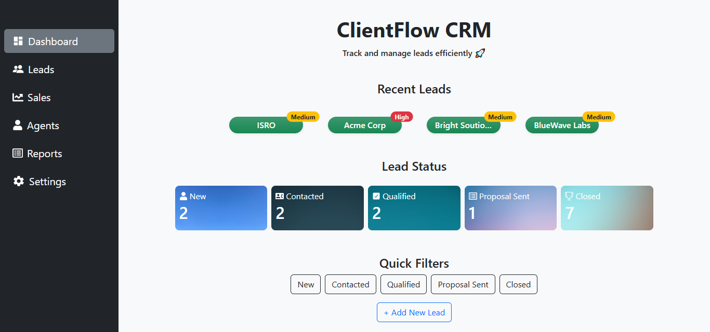
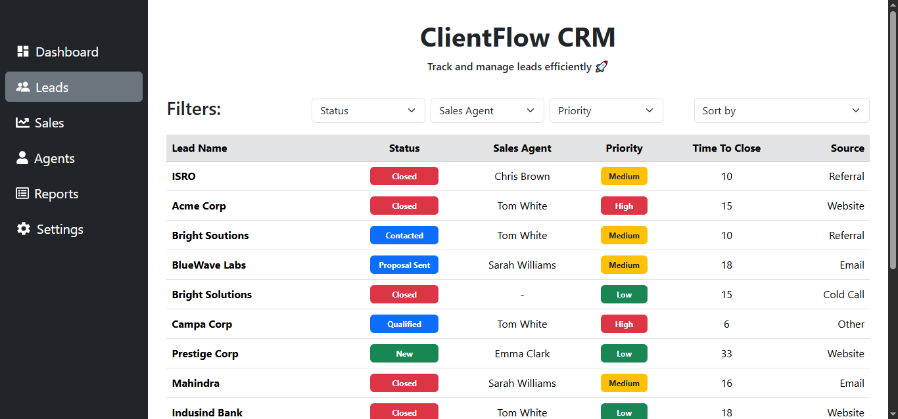
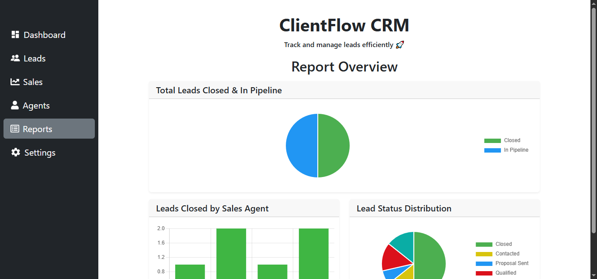

# ClientFlow CRM

A full-stack, lightweight and modern **Customer Relationship Management(CRM)** application built to help teams manage leads, sales agents and performance insights efficiently.

Built with React frontend, Express/Node backend and MongoDB database.

<!-- ClientFlow CRM focuses on clean UX, real‑world CRM workflows, and scalable architecture. -->

---

## Demo Link

[Live Demo](https://clientflow-crm-frontend.vercel.app/)

---

<!-- ## Login

> **Guest**
> Username: `guest_user`
> Password: `guest_pass`

--- -->

## Quick Start

```
git clone https://github.com/ajmal92786/clientflow-crm-frontend.git
cd clientflow-crm-frontend
npm install
```

Create .env file:

```
VITE_API_BASE_URL=https://clientflow-crm-backend.vercel.app/
```

Start the app:

```
npm run dev
```

---

## Technologies

**Frontend**

- React JS
- React Router
- Bootstrap
- Chart.js

**Backend**

- Node.js
- Express.js
- MongoDB (Mongoose)

---

## Demo Video

Watch a walkthrough (5-7 minutes) of all the major features of this app:

[Youtube Video](https://youtu.be/BNBWFUFidNU)

---

## Features

**Dashboard**

- Recently added leads
- Lead status summary (New, Contacted, Qualified, Proposal Sent, Closed)
- Quick filters by status
- Quick action to add new leads

**Leads Management**

- View all leads in a tabular format
- Filter by:
- Status
- Sales Agent
- Priority
- Sort by Time to Close

**Lead Details**

- View complete lead information
- Edit lead details (status, agent, priority, source, etc.)
- Add comments to track lead progress

**Sales Agents**

- List all sales agents
- Create new sales agents

**Reports & Analytics**

- Pie Chart: Closed vs In‑Pipeline leads
- Bar Chart: Leads closed by each sales agent
- Pie Chart: Lead distribution by status

**Settings**

- Manage all leads
- Manage all sales agents
- Safe delete with validation & feedback

<!-- **Authentication**
- User Signup and login with JWT
- Protected routes for adding/editing leads or agents -->

---

## 📸 Screenshots

### Dashboard Page



### Product Listing



### Report Page



---

## 🔗 API Reference

### 🔹 Leads APIs

#### **GET /leads**

Fetch all leads (supports filters & sorting)

Query Params:

- `status`
- `salesAgent`
- `priority`
- `sortBy`
- `order`

Response:

```json
[
  {
    "id": "leadId",
    "name": "Client A",
    "source": "Website",
    "salesAgent": { "id": "agentId", "name": "John Doe" },
    "status": "Qualified",
    "priority": "High",
    "timeToClose": 10,
    "createdAt": "2024-01-01"
  }
]
```

---

#### **GET /leads/\*\***:id\*\*

Fetch lead by ID

---

#### **POST /leads**

Create a new lead

Body:

```json
{
  "name": "Client B",
  "source": "Referral",
  "salesAgent": "agentId",
  "status": "New",
  "priority": "Medium",
  "timeToClose": 7
}
```

---

#### **PUT /leads/\*\***:id\*\*

Update lead details

---

#### **DELETE /leads/\*\***:id\*\*

Delete a lead

---

### 🔹 Sales Agents APIs

#### **GET /agents**

Fetch all sales agents

Response:

```json
[
  {
    "id": "leadId",
    "name": "Agent Name",
    "email": "agent@example.com"
  }
]
```

---

#### **POST /agents**

Create a new sales agent

Body:

```json
{
  "name": "Jane Smith",
  "email": "jane@example.com"
}
```

---

#### **DELETE /agents/\*\***:id\*\*

Delete sales agent

---

### 🔹 Reports APIs

#### **GET /report/pipeline**

Returns total closed vs in‑pipeline leads

Response:

```json
{
  "totalClosedLeads": 12,
  "totalLeadsInPipeline": 8
}
```

---

#### **GET /report/closed-by-agent**

Returns leads closed by each sales agent

Response:

```json
[
  { "agentName": "John Doe", "count": 5 },
  { "agentName": "Jane Smith", "count": 7 }
]
```

---

## Contact

For bugs or feature request, please reach out to:

📧 **[ajmalbly27@gmail.com](mailto:ajmalbly27@gmail.com)**
